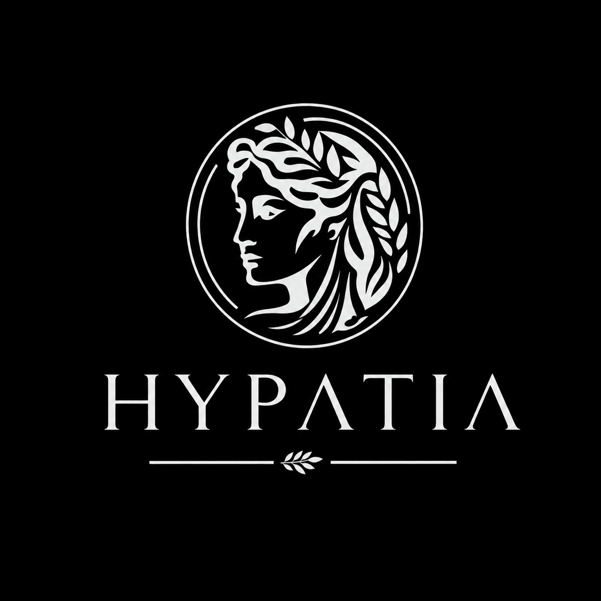

# Hypatia



Hypatia is an Expo + React Native app with a tab-first mobile UX for exploring civic and economic information.

The app currently includes:

- an **Economy Dashboard** with macro pulse chart, KPI strip, and sector drilldowns,
- a dedicated **Economy Detail** flow with stack navigation and gesture back,
- a searchable **Politician Profiles** experience backed by local mock data,
- supporting `Home` and `Explore` tabs for additional feature development.

## Core features

### Economy

- `app/(tabs)/economy.tsx`: high-level dashboard with:
  - top economic pulse line chart,
  - compact KPI cards,
  - sector tiles that navigate to detail views.
- `app/economy/[sectorId].tsx`: sector deep-dive screen with:
  - header configured via stack options,
  - interpretation + key metrics,
  - swipe-back enabled through stack navigation.

### Politician

- `app/(tabs)/politician.tsx` provides:
  - type-ahead name search,
  - loading/empty/result states,
  - profile summary and metrics,
  - key positions and recent headlines,
  - trend chart visualization.

## UX and design system direction

Recent improvements introduced:

- shared route constants in `constants/app/routes.ts`,
- semantic theme tokens in `constants/theme/ThemeTokens.ts`,
- reusable primitives in `components/ScreenHeader.tsx`, `components/SectionCard.tsx`, and `components/EmptyState.tsx`,
- accessibility-friendly tab metadata with icon-first presentation.

## Tech stack

- [Expo](https://expo.dev) + React Native
- [expo-router](https://docs.expo.dev/router/introduction/) for file-based routing
- TypeScript

## Quick start

1. Install dependencies:

   ```bash
   npm install
   ```

2. Create local env file from the template:

   ```bash
   cp .env.example .env
   ```

   On Windows PowerShell:

   ```powershell
   Copy-Item .env.example .env
   ```

3. Start the development server:

   ```bash
   npx expo start
   ```

4. Open the app in Expo Go, simulator, emulator, or web from the Expo CLI menu.

## Environment variables and API keys

- `EXPO_PUBLIC_*` variables are bundled into the client and are public.
- Use `.env` for local client config (for example `EXPO_PUBLIC_API_BASE_URL`).
- Store secret API keys only in your backend/Flask environment, never in the Expo app.

## Useful scripts

- `npm run start` - Start Expo.
- `npm run android` - Open Android target.
- `npm run ios` - Open iOS target.
- `npm run web` - Run web target.
- `npm run typecheck` - Run TypeScript checks.
- `npm run lint` - Run linting.
- `npm run test:navigation-smoke` - Verify economy route/navigation contract.
- `npm run check` - Run typecheck + lint + navigation smoke checks.

## Project structure

- `app/` - Route screens, tab layout, and stack detail screens.
- `components/` - Shared UI: `theme/`, `surfaces/`, `layout/`, `navigation/`, `charts/`, and `ui/` (tab bar, icons).
- `hooks/` - Reusable hooks; feature hooks live under `hooks/feed/`.
- `constants/` - `app/` (routes, config), `theme/` (colors, tokens, typography), `data/` (static datasets).
- `scripts/` - Local helper scripts and smoke checks.

## Notes

- The project started from `create-expo-app` and has been customized for Hypatia-specific UX flows.
